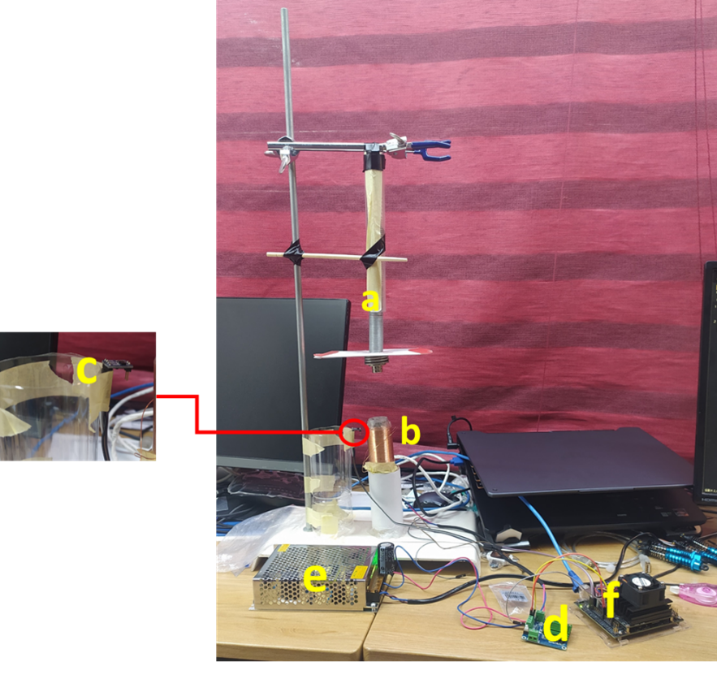
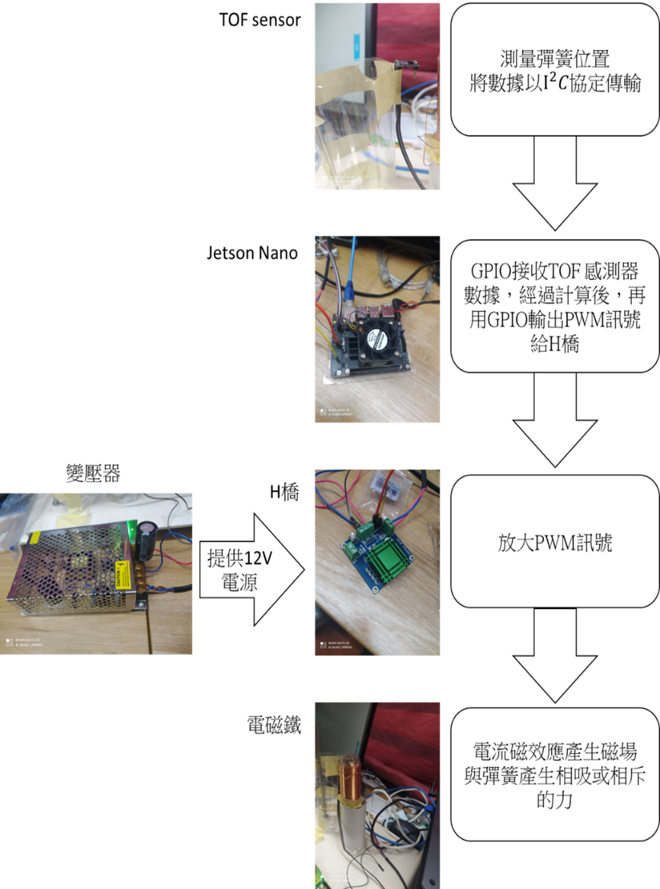
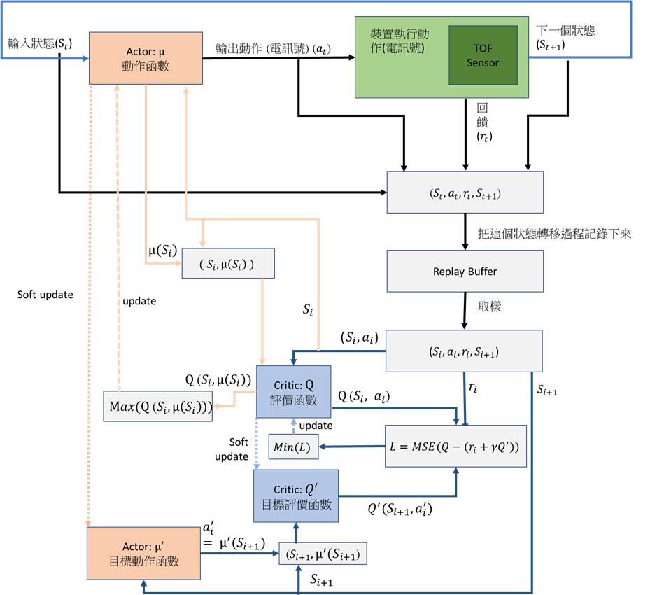
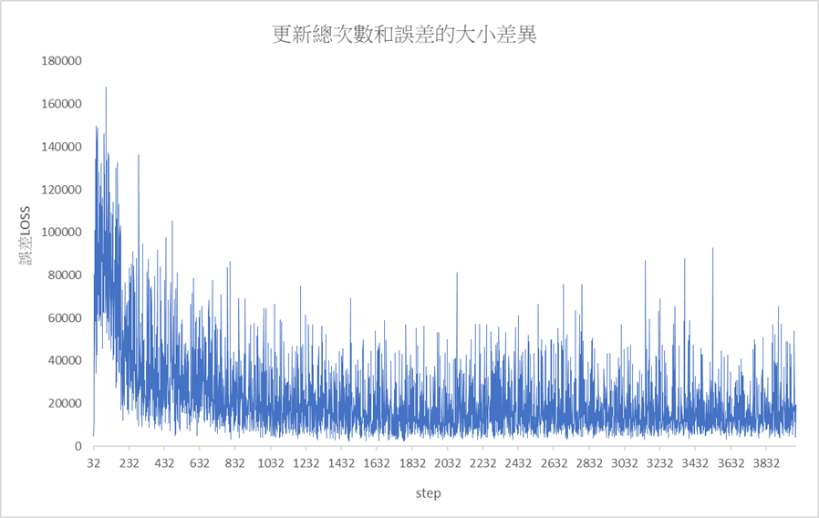
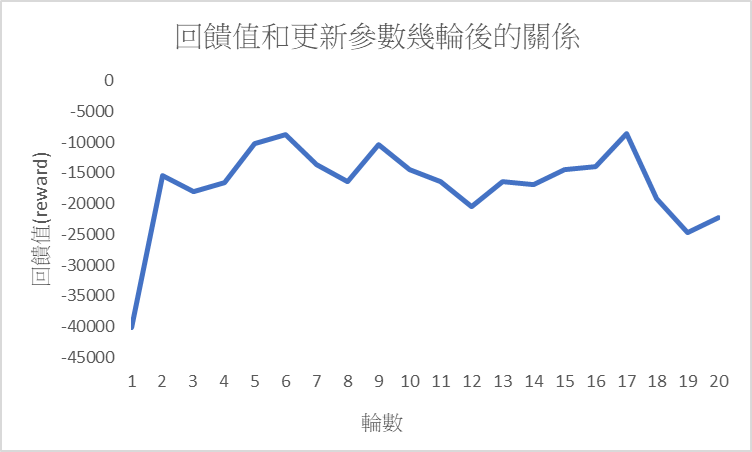
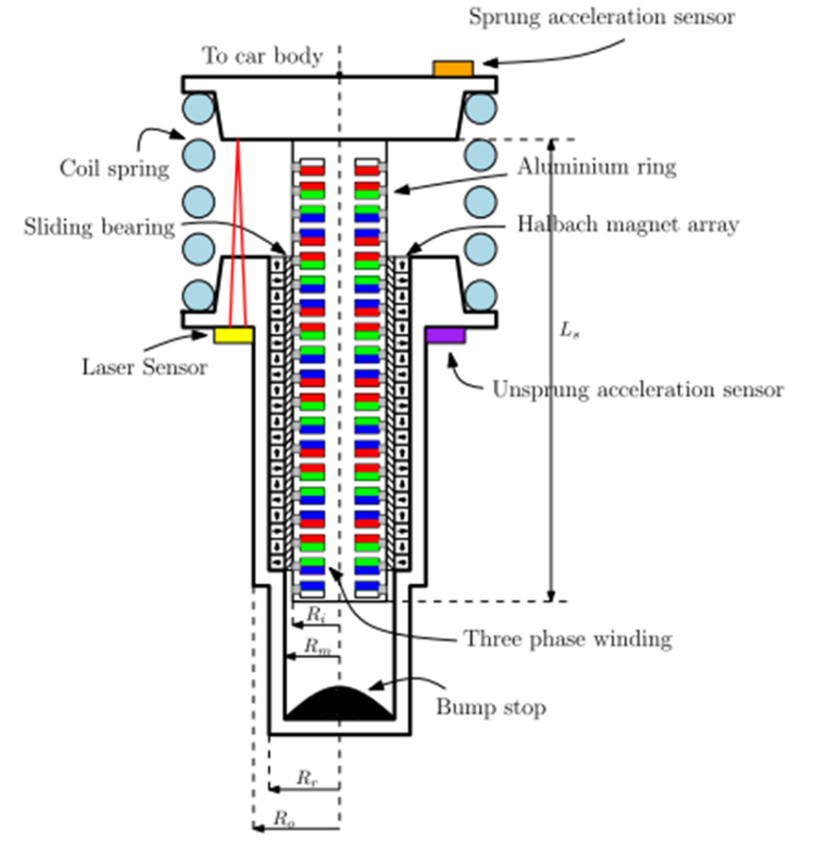

# 
active-suspension

[彈簧控制新方法之研究-簡報版影片](https://youtu.be/L1lFQSBEa4Q)

[備用 README](https://hackmd.io/@peter12345678/HkYAuLBPq)

## 
摘要

* 目前常見震動控制器通常是用磁流變液和電流變液減震器以改變剛性或是使用液壓來改變阻尼係數，這樣的控制方式反應速度較慢且效果較差，本研究探討如何以強化學習算法來控制電訊號改變線圈產生的磁場，能讓彈簧在震盪過程中更快達到較小振幅或是停止

---

## 
研究動機

* 目前常見的震動控制器通常是用磁流變液或液壓或是氣動的方法來改變阻尼係數或剛性，這樣的控制方式由於流體流速會造成反應速度較慢，因此我想以改變磁場的方式控制;利用強化學習算法控制，使震動控制更為精準快速，補足傳統機械控制理論的不足

---

## 
研究目的

* 研究以強化學習控制電訊號在線圈中產生磁場，控制彈簧減振的避震效果

---

## 
研究設備及器材

> a.      彈簧 : 震動本體，在其周圍加裝塑膠套管使其震動維持在一維方向
> 
> b.     電磁鐵 : 用輸入的電流控制磁場方向與大小，進而和彈簧產生相吸相斥的力量
> 
> c.      TOF 感測器 : 測量並回傳與目標物的距離
> 
> d.     變壓器 : 加上一顆電容用以穩壓
> 
> e.      H橋 : 可改變其連接的負載兩端電流方向和放大電流，用以輸出控制電磁鐵的電流
> 
> f.      NVIDIA Jetson Nano : 運算用的機器，可接收 TOF 感測器的資料和輸出PWM訊號給H橋

---

## 
研究過程或方法

#### 實驗裝置設計

---

#### 軟體與環境互動圖

---

### [備用 README](https://hackmd.io/@peter12345678/HkYAuLBPq)
- 聽說 github 已經可以支援 MathJax 了, 但是不知道為什麼我的頁面沒被渲染(可能是我電腦的問題)

#### 環境和DDPG算法互動步驟 (與上圖相同)

1. $\mu$ 定義為 actor 函數，每一步的行為可以通過 $a_t=\mu(s_t)$計算獲得，用一個深度神經網路對 $\mu$ 函數模擬，因此稱為 `actor net`, 參數以 $\theta^\mu$ 表示
2. $Q$ 定義為 critic 函數：用一個深度神經網路對 $Q$ 函數模擬，因此稱為 `critic net`，參數以 $\theta^Q$ 表示
3. 透過兩個相同的網路架構但是一個以梯度下降法更新參數，一個以較慢速度更新參數 (soft update)，各稱為 `online net` 和 `target net`，`online net` 分別表示為 $Q$ 和 $\mu$，`target net` 分別表示為 $Q'$ 和 $\mu^′$，這樣做的優點為 `target net` 更新速度較慢，因此用於訓練 `online net` 的梯度下降更新參數時，較為穩定，易收斂
4. 裝置執行 $a_t$，返回 $r_t (reward)$ 和新的狀態 $s_{t+1}$
   - 定義 $d_t$ : 離平衡位置距離= 當前彈簧與感測器距離 – 在靜止狀態的彈簧與感測器距離(單位 : $mm$)
   - 定義 $v_t$ : 彈簧速度 =  $\frac{第二次測量的距離 – 第一次測量距離}{兩次測量的時間差}$ (單位 : $mm/s$)
   - 定義 $a_t$ : 動作大小 $a_t = \mu(s_t)$，GPIO 的 PWM 的佔空比能指定的範圍只有 $0$ 到 $100$，且要輸出兩種方向的數值，所以 $a_t$ 的數值介於 $[-100, 100]$
   - 設計一個 reward 函數 : $r_t=−(d_t^2+v_t^2+a_t^2)$, 顯然 $r_t$ 最大值為 $0$
5. 將這個狀態轉移過程 : $(s_t,a_t,r_t, s_{t+1})$ 存入 `replay buffer` 中
6. 從 replay buffer 中，隨機採樣 $32$ 個狀態轉移數據，作為online actor($\mu$) 網路、online critic($Q$) 網路的一個 batch 訓練資料, 用 $(s_i,a_i,r_i, s_{i+1})$ 表示 batch 中的單個狀態轉移
7. 定義誤差(Loss) : $L(\theta^Q)=$ ***MSE*** $(Q(s_i,a_i)−(r_i+\gamma Q^′(s_{i+1},\mu^′ (s_{i+1}))))$
   - 可視為 `label` = $r_i+\gamma Q^′(s_{i+1},\mu^′ (s_{i+1}))$ 和 `predict` = $Q(s_i,a_i)$ 之間做 ***MSE***
   - 以最小化誤差為目標 : ***Min***$(L(\theta^Q))$, 並更新 online critic($Q$) 的參數 $\theta^Q$
8. 定義 $J(\theta^\mu)=Q(s_i,\mu(s_i))$
   - 以最大化$J(\theta^\mu)$為目標 : ***Max***$(J(\theta^\mu))$, 並更新 online actor($\mu$) 的參數 $\theta^\mu$
9. $soft\; update$ : 最後以 `online critic net` 和 `online actor net` 的參數，用soft update 更新 `target critic net` 和 `target actor net` 的參數
   - $\theta^\mu$ : `online actor net` 的參數
   - $\theta^{\mu^{'}}$ : `target actor net` 的參數
   - $\theta^Q$ : `online critic net` 的參數
   - $\theta^{Q^{'}}$ : `target critic net` 的參數

$$
soft\;update:
\left\{
\begin{aligned}
\theta^{Q^{'}} & \leftarrow  \tau\theta^Q + (1-\tau)\theta^{Q^{'}}\\
\theta^{\mu^{'}} & \leftarrow \tau\theta^\mu + (1-\tau)\theta^{\mu^{'}}
\end{aligned}
\right.
,\; \tau = 0.001
$$

10. 以 `Adam optimizer` 更新 `online critic net` 和 `online actor net` 的參數，$soft\; update$ 更新 `target critic net` 和 `target actor net` 的參數

---

## 
研究結果

---

## 
討論

1. 橫坐標是從 $32$ 開始是因為每次取樣的批次大小都是 $32$，因此必須要等到 `replay buffer` 裡有 $32$ 筆以上(含)的資料才能取樣
2. 誤差$L(\theta^Q)=$ ***MSE*** $(Q(s_i,a_i)−(r_i+\gamma Q^′(s_{i+1},\mu^′ (s_{i+1}))))$有收斂的趨勢，顯示這個問題是可以以神經網路模擬控制策略，並經由重複迭代的過程更新參數找出最優解，也因為可以在線更新參數的原因，可以藉由微調大模型參數的技巧來適應不同的環境
3. 誤差和環境回饋值會有震盪是因為目前的 `actor net` 和 `critic net` 所學習到的參數應還是區域最小值的解，要真的達到全域最小值還是需要更多的狀態轉移過程的累積和超參數不斷地才有機會達到

---

## 
結論

1. 實驗結論 :
   > 經過在實際環境中測試發現以強化學習算法控制振盪效果有明顯效果，和許多舊的方法相同都是可以快速地使震動停下，但是相較於以往的固定算法，這種可以在線更新參數的方法的自適應能力是其所無法達成的，且在算力的加持下，計算速度越快，反應時間也就越快，因此如果把此裝置部屬在車輛的主動式懸吊上應該可以得到不錯的避震效果，或是使用在防止精密儀器震動上或許也能不錯的效果，除非有一天人類克服了重力
2. 未來展望 :
   > 未來在實驗裝置的改善方面會把磁鐵以海爾貝克陣列的方式將磁場集中在軸中間，能使電磁鐵的效率更高，就能使控制時所消耗的能量大幅減少，且因在一個海爾貝克陣列上會有很多方向的磁場，如果對於每個方向的磁場都放置一個電磁鐵，就能控制出更精細的動作，不過同時由於輸出的維度相對多了好幾倍，因此需要累積更多的資料去做參數更新，以及環境的誤差要變小，避免整個模型的參數網錯誤的方向學習
   > 
   > |  |
   > |:--:|
   > | *海爾貝克陣列用於避震器中示意圖* |

---
